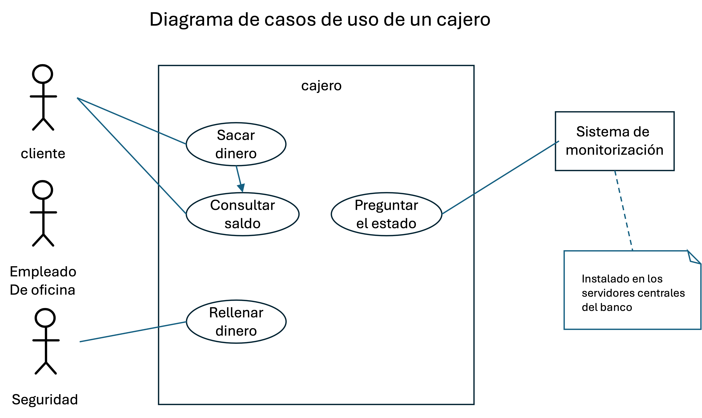
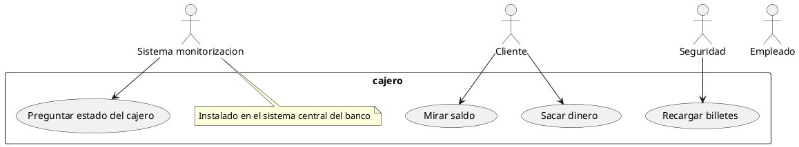

# Qué es UML?

**Unified Modeling Language**. Es un lenguaje formal regulado por una norma ISO.

Hay muchas herramientas que podemos usar para escribir en este lenguaje.
Igual que para el lenguaje Español podemos usar el Word, o una hoja de papel.

Los lenguajes los clasificamos en:
- Lenguajes formales:  Tiene reglas gramaticales MUY RIGIDAS.
- Lenguajes naturales: Tiene reglas gramaticales más laxas. Es más... aunque las incumplamos, nos entendemos.
                       Los que hablamos los seres humanos

Desde que somos pequeños, aprendemos 2 lenguajes. De hecho, uno natural y otro formal.
- Lenguaje natural: Español, Catalán, Gallego,...
    "dos más dos son cuatro"
- Lenguaje forma: Matemático
    2 + 4 = 6
    Alfabeto: 1029374645+-()=
        

Los lenguajes, como los lenguajes de programación, se llaman lenguajes por un motivo. Qué tiene un lenguaje que le confiere el hecho de poder ser denominado lenguaje?

EMOJI expresa? SI... y los emojis son un lenguaje? NO... son un alfabeto!
Un ABRAZO COMUNICA? SI... y los abrazos son un lenguaje? NO... son una forma de comunicación!

Los lenguajes necesitan de una GRAMATICA. Y los emojis no tienen gramática. Los abrazos tampoco.
Esa gramática se compone de unas reglas sintácticas, unas reglas semánticas y una reglas morfológicas.
- Morfología va de unir el alfabeto para formar entes de mayor nivel... y de la forma en la que se unen.
- Sintaxis va de la forma en la que se combinan esos entes de mayor nivel para expresar ideas.
- Semántica va del significados de esos entes de mayor nivel.

UML también tiene su gramática.. especificada en una norma ISO... Eso suena a sencillo? o a tostón? TOSTON !!!!
Y lo es. es un puro tostón.

Ahora bien!
Qué tal vuestro nivel de Español? Comparado con qué o quién?
Si lo tuvierais que valorar de 1 a 10? 7-8
Metéis la pata a veces con expresiones, laísmos, faltas de ortografía? SI
Os limitan esa pequeñas faltas el poder expresaros en español? NO mucho (para algunas cositas más concretas puede que un poco)

Con UML nos pasa igual. Si pretendemos ser el Garcilaso de la Vega o el Shakespeare del UML... vamos bien jodidos! Ahora bien... no manejarlo a la perfección, tampoco tiene porque limitarme.

---

UML es un lenguaje VISUAL (GRAFICO), para hacer diagramas que me ayuden cuando modelo un sistema/producto.
Lo que se busca es "estandarizar" esos diagramas, para que yo no me invente mis propios símbolos y luego nadie me entienda.

Claro... aquí hay otro problema paralelo. Hemos dicho que vamos a usar UML para modelar sistemas.
Por ende, lo primero que necesito saber es de modelado de sistemas. Y eso es un mundo en sí mismo.

---

# Qué nos ofrece UML?

Reglas para rear diagramas de 2 tipos:
- Diagramas estructurales/estáticos
  - Diagramas de clases
  - Diagramas de objetos
  - Diagramas de componentes
  - ...
- Diagramas de comportamiento/dinámicos: 
  - Diagramas de casos de uso
  - Diagramas de máquinas de estado
  - Diagramas de secuencia
  - Diagramas de actividad
  - ...

---

## Esto del UML es nuevo?

Tiene más años que Maricastaña: Más de 30 años.
Se usa mucho? NO... cayó en desgracia hace muchos años! Y eso? por qué?

- Es malo? No, nada malo... es genial. Nos ayuda mucho a crear diagramas que ayuden a transmitir ideas.
- Es complejo? No necesariamente... si no me quiero liar mucho.
- Es poco práctico? poco útil? Qué va.. es guay! Nos ayuda mucho a transmitir ideas.
- Entonces?... no ay programas que permitan manejarse con UML? A CIENTOS !!!!
  De hecho hay programas que han quitado UML porque nadie lo usaba: Por ejemplo: Microsoft Visual Studio.
- Es caro? No no.. si es un lenguaje.. no es un producto. Los lenguajes son de dominio público... no tienen precio.

## Dónde está el problema?

- Cuando surge UML, la gente se OBSESIONA (norma ISO, hay que cumplirla al 100%... etc.etc.) ESTO ES DURO !
  Se quiero conseguir que el código de programación se genere semi-automáticamente a partir de los diagramas UML... (cualquier ligera variación en en el uso de las reglas gramaticales de UML, puede hacer que el código generado sea una basura)
- Los programas que han existido son un tostón.... sin tipo PowerPoint... con cajitas... flechitas... RATONCITO, click... y horas y horas de trabajo.
- Hago un diagrama... para expresar unas ideas... a medida que el proyecto avanza, las ideas suelen cambiar y los diagramas quedan obsoletos (requieren mantenimiento).

## Últimamente está habiendo un resurgir de UML. Por qué?

- Menor nivel de obsesión con la norma ISO. Entendemos que el objetivo es Transmitir información.
- Herramientas más modernas y fáciles de usar.
  En concreto, hay unas herramientas que me permiten ESCRIBIR diagramas. ¿EIN? Sí... escribir diagramas.
  Hay lenguajes "nuevos" escritos que me permiten escribir diagramas. Posteriormente esos escritos son interpretados por programas y generan en automático los diagramas gráficos:
    - PlantUML
    - Mermaid
- Es más... si se trata de escribir.. a los humanos en los últimos años nos han pasao' por la derecha... y ni nos hemos entera': IAs Generativas (chatGPT, Github Copilot, etc.)... En lenguajes naturales... En lenguajes FORMALES ni te cuento... ahí ya nos mean!
  - Hoy en día puedo pedirle a chatGPT que me escriba un diagrama UML en mermaid... y tarda 2 segundos.
    ASI SI TIOOOO!!!!!

UML lo puedo pintar en papel con un lapicero poco afila'o. Puedo usar power point... pero mete horas.

# Qué representamos en un diagrama?

Lo que me dé la real gana!
El lenguaje es un lenguaje.. y lo uso para lo que me de la real gana.

Depende de lo que quiera transmitir, y de a quién se lo quiera transmitir Y esto, que parece una gilipollez, es la clave. Muchas veces con UML nos obsesionamos... y tratamos de representar el sistema REAL que tengo delante o que tengo en la cabeza o que estoy montando... Y NO!

En el diagrama representaré lo que sea interesante transmitir a un determinado INTERLOCUTOR.

Por ejemplo. 
- Tengo que escribir un email para contarle a mi cliente qué tal va a el proyecto.
- Tengo que escribirle un email a mi jefe para que sepa como va el proyecto.
- Tengo que escribir un email para mi equipo de trabajo para que sepan cómo va el proyecto.

---

Esto nace para modelar proyectos SOFTWARE... más delante, otras industrias comienzan a utilizar los diagramas de UML para sus propios proyectos... Es más, aparecen incluso extensiones a UML para adaptarlo a otros sectores: sysML (modelade de sistemas-Hardware), BPMN (modelado de procesos de negocio), etc.

Al diseñar/modelar un sistema (y en el curso vamos a hablar tanto de sistemas software como hardware) de qué partimos?

- Casos de uso: Intentamos entender quién va a usar el sistema y para qué. AQUI HAY POCA INFORMACION!
   vvvvvvvv
- Requisitos

| Diagramas de casos de uso ----- Lo que memos información tiene (información muy abstracta)
|
| Diagramas de máquinas de estado
|
| Diagramas de secuencia / Diagramas de actividad
|
| Diagramas de componentes
|
| Diagramas de clases
|
v Código                    ----- El mayor nivel de detalle (La información más concreta que se puede tener)

Y pasar de arriba a abajo require:
- Ir concretando más el sistema
- Pasta
- Tiempo

---

- Ejemplo 1: Cajero automático (de los del banco)... en especial centrándonos en la operativa para sacar dinero.
- Ejemplo 2: Máquina expendedora de café (de la que hay en las oficinas en los pasillos)
- Ejemplo 3: App para manejar diccionarios y buscar palabras.

---

# Diagramas de casos de uso

A la hora de enfrentarnos a esos sistemas, vamos a empezar creando unos diagramas de CASOS DE USO.
En ellos representamos:
- Actores: Personas (humanas) que interactúa con el sistema
- Participantes: Otros sistemas que interactúan con el sistema
- Casos de uso: Funcionalidades que el sistema ofrece a los actores/participantes
- Relaciones entre actores y casos de uso, y entre casos de uso y otros casos de uso.

Además, en todo diagrama UML hay algunas cosas genéricas que siempre aparecen:
- Notas / comentarios
- Leyendas
- Cualquier otra cosa que yo considere interesante para representar la información que quiero transmitir.

UML nos ofrece una reglas acerca de cómo representar los actores, los casos de uso, las relaciones, etc.

Actores:        Iconos de seres humanos similares a los que pintamos en el juego del ahorcado.
    O           Debajo del icono escribimos el nombre del actor.
   /|\
   / \

Participantes:  Iconos de cajas, dentro de las cuales escribimos el nombre del participante.
    +-----+
    |     |
    +-----+

Casos de uso:   Elipses, dentro de las cuales escribimos el nombre del caso de uso.

Los actores estarán relacionados con los casos de uso mediante líneas de relación. Lineas rectas, sólidas, sin terminaciones especiales (flechas o cosas de esas).
Algunos casos de uso estarán relacionados con otros casos de uso mediante líneas de relación. 
En ese caso, si usamos lineas que acabarán con una punta de flecha. La flecha indica DEPENDENCIA (NO FLUJOS).

Necesito representar en el diagrama de casos de uso a TODOS los actores y TODOS los casos de uso? NO!
Representaré lo que me de la real gana. Lo que sea interesante para el interlocutor al que va dirigido el diagrama. Y puedo montar 17 diagramas de casos de uso de mi sistema... cada uno dirigido a un interlocutor diferente.... o todos dirigidos al mismo interlocutor... cada uno contándole una cosa diferente.

En nuestro caso hemos representado:
- Actores: Cliente, Empleado, Seguridad
- Participantes: Sistema de monitorización
- Casos de uso: Sacar dinero, mirar saldo, recargar billetes, preguntar el estado del cajero.

Este diagrama, en lugar de pintarlo, lo podríamos haber escrito en PlantUML:

Vamos a escribir ese diagrama en texto, como si fuera un documento word:

Tenemos un sistema de cajero automático. En él interactúan 3 actores: Cliente, Empleado y Seguridad. Además, el sistema de monitorización del banco también interactúa con el cajero. Los actores Cliente y Empleado pueden sacar dinero y mirar su saldo. El actor Seguridad puede recargar billetes. El sistema de monitorización puede preguntar el estado del cajero.

---

Bajamos en nivel... seguimos trabajando en el proyecto.

# Diagramas de secuencia

Y voy a tratar de explicar las interacciones (comunicaciones) que tiene lugar cuando una persona se presentar en un cajero y quiere sacar dinero.

En estos diagramas representamos otros a conceptos distintos a los que representamos en los diagramas de casos de uso:

- Actores: Siguen apareciendo, de la misma forma que en los diagramas de casos de uso.
- Participantes: Siguen apareciendo, de la misma forma que en los diagramas de casos de uso.
Pero... ambos 2 se representan en la misma linea horizontal. Y esa linea horizontal se pone por duplicado, donde cada actor/participante se une consigo mismo mediante lineas discontinuas verticales:
- Comunicaciones: Flechas que indican la comunicación entre actores/participantes. Las flechas se ponen entre las lineas verticales. El orden de las flechas (de arriba a abajo) indica el orden de las comunicaciones.