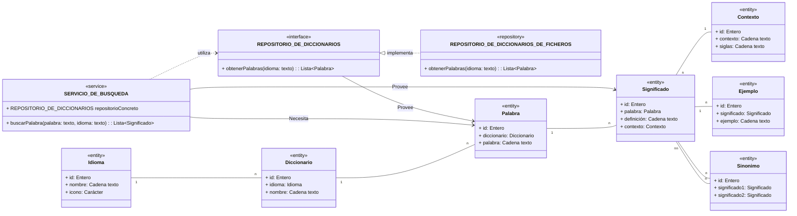

    CÓDIGO <> PRUEBAS -> OK --> REFACTORIZAR <> PRUEBAS -> OK
    ------------------------    ------------------------------
    Solo el 50% del trabajo         El otro 50% del trabajo
        8 horas                       8 horas


----

## POO

Los lenguajes me permiten crear programas que manipulan DATOS.
Cualquier lenguaje me permite trabajar con ciertos tipos de datos.

Hay lenguajes que me permiten definir mis propios tipos de datos, explicando sus características y las operaciones que puedo hacer sobre ellos.

Ya había lenguajes más antiguos que nos permitían definir tipos de datos propios: Por ejemplo, en C teníamos el concepto de Struct. En ADA teníamos el concepto de RECORD.

Esto va un paso más. No solo definimos las características de un tipo de datos, sino que también definimos las operaciones que puedo hacer sobre ese tipo de datos.

ESO TIPOS DE DATOS QUE DEFINIMOS es lo que llamamos CLASES.
Los datos concretos de un tipo de datos (de una CLASE) los denominamos OBJETOS.

    TIPO DE DATO = CLASE            OBJETOS
    String                          "Hola"  "Adios"
    Double                          33.3    44.4

Hay un tipo de clase que llamamos ENTIDADES/MODELOS.
Son clases que definen características/propiedades de un tipo de datos (una tabla de BBDD con su columnas).
Generalmente representan conceptos que existen o se trasladan al mundo REAL:
- DICCIONARIO
- PALABRA
- EJEMPLO

Antiguamente, solíamos crear clases que definían datos / propiedades y operaciones / métodos.

Hoy en día, esto lo tenemos más ORGANIZADO... hay consensos/convenios

Hay otros tipos de clases. Hay clases que SOLO (o casi solo) definen operaciones / métodos. En función del tipo (de la naturaleza) de esos métodos, a esas clases les ponemos nombres diferentes:
- Servicio      Clase que contiene lógica de negocio
- Repositorio   Clase que contiene lógica de acceso a datos / persistencia
- Controlador   Clase que contiene lógica de presentación / exposición de funciones/datos
- ...

    $ buscarPalabra ES manzana
        Esa palabra 'manzana' existe en el diccionario de Español y significa: 
            - Fruto del manzano

    $ buscarPalabra ES archilococo
        Esa palabra: 'archilococo' no existe en el diccionario de Español
        
    $ buscarPalabra IdiomaDeLosElfos Elénsirvir
        No tenemos diccionario para el idioma 'IdiomaDeLosElfos'


    $ buscarPalabra ES melón
        Esa palabra 'melón' existe en el diccionario de Español y significa: 
            - Fruto del melonero
            - (sf) Persona con pocas luces. Ej: Eres un melón! no te enteras de nada!

        vvvvvvvv ?? Los usuarios son los que hostigarán (solicitarán) a alguien (Cliente) que se pondrá en contacto 
                    conmigo (YO OH ! DESARROLLADOR)

    $ buscarPalabra 
        Por favor, indique el idioma de la palabra que desea buscar: ES
        Perfecto. Ahora indique la palabra que desea buscar: melón
        Realizando búsqueda.....
        Encontrado! Esa palabra 'melón' existe en el diccionario de Español y significa: 
            - Fruto del melonero
            - (sf) Persona con pocas luces. Ej: Eres un melón! no te enteras de nada!

    Nuestras palabras (las que guardamos en el diccionario) tienen significados, ejemplos, sinónimos...
                                                            y ahora además deben tener antónimos.

        Ese cambio impacta a los usuarios... pero impacta a otro perfil de la app: A otro ACTOR (Diagrama de Casos de Uso). A quién crea y mantiene los diccionarios.

        El hecho de querer que el programa haga búsqueda EXACTA DE PALABRAS o IGNORE ACENTOS EN LA BUSQUEDA


# Aplicando programación procedural

MODELOS/ENTIDADES:
- IDIOMA (codigo, descripcion)
- DICCIONARIO (nombre, idioma)
- PALABRA     (diccionario, texto)
- SIGNIFICADO   (palabra, texto, contexto)
- EJEMPLO (significado, frase)
- CONTEXTOS (codigo, descripcion) : "des." -> En desuso.
                                    "quim" -> Usado principalmente en "Química"

REPOSITORIO <- Clase
- Función: abrir fichero de diccionario
- Función: cerra fichero de diccionario
- Función: leer fichero de diccionario

CONTROLADOR DE SALIDA <- Clase
- Función: mostrar significados de una palabra
- Función: Mostrar palabra no encontrada en diccionario
- Función: Mostrar idioma no existente

CONTROLADOR DE ENTRADA <- Clase
- Función: Capturar el idioma
- Función: Capturar la palabra

SERVICIO DE BUSQUEDA DE PALABRAS <- Clase
- Función: Buscar exacta de palabras en diccionario <- USUARIOS
- Función: Buscar ignorando acentos en diccionario <- USUARIOS
- Función: Buscar las palabras que empiezan por un prefijo
        Quiero todo llo que empiece por manzana:
             manzana, manzanilla, manzanar, manzanero, manzanilla, manzanilla

SERVICIO DE GESTION DE DICCIONARIOS <- Clase
- Función: Añadir palabra en diccionario <- EDITORES DE DICCIONARIOS
- Función: Añadir significado a palabra en diccionario <- EDITORES DE DICCIONARIOS
- Función: Borrar palabra en diccionario <- EDITORES DE DICCIONARIOS


---- 

En todas las profesiones nos acogemos a unos principios.
CUIDADO!

La palabra principio tiene varios significados diferentes: Vamos a mirar 2 de ellos:
- LEY (de la física, de la química, de la matemática)
- REGLA MORAL (deontológica, ética, sociología)
  - Las personas tenemos principios y esos principios guían nuestra forma de comportarnos y la toma de decisiones.

Tened en cuenta que nuestro negocio se llama: INGENIERÍA DEL SOFTWARE.

INGENIERÍA: Trata de resolver problemas ajustando TIEMPO, RECURSOS y DINERO.

Hay otro, llamado CIENCIAS DE LA COMPUTACIÓN: Las ciencias de la computación son una CIENCIA EXACTA, igual que la física, la química, la matemática. Y en ella hay PRINCIPIOS (LEYES) que se cumplen siempre.

Pero nosotros estamos en ingeniería del software. Y en ingeniería del software, hay PRINCIPIOS (REGLAS) que me ayudan a tomar decisiones, igual que en la vida.

En el mundo del desarrollo de software:
- SOLID: % principios. Cada letra es un principio.
    S - Single Responsability Principle: Una clase / módulo debe atender a un único actor.
    O - Open/Closed Principle
    L - Liskov Substitution Principle (En honor a su creadora BARBARA LISKOV)
    I - Interface Segregation Principle
    D - Dependency Inversion Principle <- EL MAS IMPORTANTE !
- KISS: Keep It Simple, Stupid
- YAGNI: You Aren't Gonna Need It
- DRY: Don't Repeat Yourself
- SoC: Separation of Concerns

# Principio de inversión de dependencias

Ese principio aplica a las clases que definen funcionalidades / operaciones / métodos:
- Repositorio
- Controladores
- Servicios

Y dice: Una clase de un sistema (una clase de esos tipos... no modelos/entidades) no debe depender de otra clase (de los mismos tipos) de un sistema. Ambas deben depender de ABSTRACCIONES.


REPOSITORIO <- Clase
- Función: abrir fichero de diccionario
- Función: cerrar fichero de diccionario
- Función: leer fichero de diccionario

CONTROLADOR DE SALIDA <- Clase
- Función: mostrar significados de una palabra
- Función: Mostrar palabra no encontrada en diccionario
- Función: Mostrar idioma no existente

CONTROLADOR DE ENTRADA <- Clase
- Función: Capturar el idioma
- Función: Capturar la palabra

SERVICIO DE BUSQUEDA DE PALABRAS <- Clase
- Función: Buscar exacta de palabras en diccionario <- USUARIOS
- Función: Buscar ignorando acentos en diccionario <- USUARIOS
- Función: Buscar las palabras que empiezan por un prefijo
        Quiero todo llo que empiece por manzana:
             manzana, manzanilla, manzanar, manzanero, manzanilla, manzanilla

SERVICIO DE GESTION DE DICCIONARIOS <- Clase
- Función: Añadir palabra en diccionario <- EDITORES DE DICCIONARIOS
- Función: Añadir significado a palabra en diccionario <- EDITORES DE DICCIONARIOS
- Función: Borrar palabra en diccionario <- EDITORES DE DICCIONARIOS

Una clase / módulo de un programa DEPENDE de otra si precisa de sus funciones para hacer su cometido.
    SERVICIO DE BUSQUEDA DE PALABRAS <- Clase
      - Función: Buscar exacta de palabras en diccionario <- USUARIOS
              vvvv
            REPOSITORIO <- Clase
            - Función: leer fichero de diccionario

Dicho de otra forma, si miro el fichero de código fuente (en el lenguaje que sea) de una clase o un módulo, en ese fichero tendré una linea de tipo : IMPORT

Mi programa (es otra clase/componente/modulo/ fichero con código) tendrá una función UNICA llamada:
    Arranca La moto, que nos vamos!     MAIN, start, run

    Mi PROGRAMA 
        main {
            CONTROLADOR DE ENTRADA: Capturar el idioma -> idioma
            CONTROLADOR DE ENTRADA: Capturar la palabra -> palabra
            SERVICIO DE BUSQUEDA DE PALABRAS: Buscar exacta de palabras en diccionario (palabra, idioma)  -> significados (si los hay o no)
            IF(si significados existen)
                if(significados.length > 0)
                if(significados != null)
                if(significados <> none)
                CONTROLADOR DE SALIDA: Mostrar significados de una palabra (significados)
            ELSE
                CONTROLADOR DE SALIDA: Mostrar palabra no encontrada en diccionario (palabra)
        }

    SERVICIO DE BUSQUEDA DE PALABRAS: 
        IMPORT REPOSITORIO DE DICCIONARIOS (interfaz)
        Buscar exacta de palabras en diccionario (palabra, idioma)  -> significados (si los hay o no)
            REPOSITORIO DE DICCIONARIOS:    obtenerPalabras  (IDIOMA) -> palabras
            aplico un algoritmo de búsqueda exacta sobre toda esa lista de palabras -> Significados si existen
            Si existen significados, los devuelvo

        aplico un algoritmo de búsqueda exacta(lista de palabras, palabra_objetivo) -> significados si existen
            Algoritmo de búsqueda binaria

    CONTROLADOR DE SALIDA: 
        Mostrar significados de una palabra (significados):
            Para cada significado: FOR
                Imprimir un guión: print("- ")
                Imprimir el significado: print(significado)
                Y un salto de línea: print("\n")

    REPOSITORIO DE DICCIONARIOS: (versión FICHEROS)
        leer fichero de diccionario  (IDIOMA) -> palabras
            Abro el fichero de diccionario
            Ir leyendo cada linea (FOR)
            Cierro el fichero de diccionario
            Devuelvo las palabras
        vvvv
    REPOSITORIO DE DICCIONARIOS: (versión: BBDD)
        sacar Palabras de la BBDD  (IDIOMA) -> palabras
            Abro conexion a BBDD
            Ejecuto SELECT * FROM palabras WHERE idioma = idioma
            Cierro la conexión a BBDD
            Devuelvo las palabras


Ese concepto de abstracción es viejo... Tiene muchos años... En el lenguaje C (que no era orientado a objetos) ya existía .
Los ficheros .h o ficheros de cabecera. 

En los lenguajes orientados a objetos, tenemos un concepto equivalente llamado INTERFAZ (ABSTRACCIONES)

Una interfaz es un casi tipo de datos (casi una clase).
Algunas clases definen lógica (funciones). De hecho definen tanto la forma de llamar a esas funciones, como el código que se ejecuta en esas funciones.

    REPOSITORIO DE DICCIONARIOS: (versión: BBDD)
        sacar Palabras de la BBDD  (IDIOMA) -> palabras
            Abro conexion a BBDD
            Ejecuto SELECT * FROM palabras WHERE idioma = idioma
            Cierro la conexión a BBDD
            Devuelvo las palabras

Una interfaz SOLO DEFINE la forma de llamar a las funciones, pero no el código.

    REPOSITORIO DE DICCIONARIOS:
        obtenerPalabras  (IDIOMA) -> palabras
            Y qué hace es función. Cómo funciona por dentro? De dónde saca las palabras? Ni lo sé. Ni me importa.
            Lo único que sé es que existe un concepto llamado REPOSITORIO DE DICCIONARIOS y que puedo pedirle que me de las palabras de un idioma, es decir que ejecute la funcion: obtenerPalabras(idioma) -> palabras
        Qué tiene dentro esa función ? NI IDEA. NO ME INTERESA.

    REPOSITORIO DE DICCIONARIOS DE FICHEROS: (ESTA CLASE DECIMOS QUE IMPLEMENTA LA INTERFAZ REPOSITORIO DE DICCIONARIOS, porque aporta el código de la función(es) definidas en la interfaz)

        IMPORT REPOSITORIO DE DICCIONARIOS (de la interfaz)

        obtenerPalabras  (IDIOMA) -> palabras
            Abro el fichero de diccionario
            Ir leyendo cada linea (FOR)
            Cierro el fichero de diccionario
            Devuelvo las palabras

    REPOSITORIO DE DICCIONARIOS DE BBDD:    (ESTA CLASE TAMBIÉN IMPLEMENTA LA INTERFAZ REPOSITORIO DE DICCIONARIOS
                                            ya que también aporta el código de la función(es) definidas en la interfaz)

        IMPORT REPOSITORIO DE DICCIONARIOS (de la interfaz)

        obtenerPalabras  (IDIOMA) -> palabras
            Abro conexion a BBDD
            Ejecuto SELECT * FROM palabras WHERE idioma = idioma
            Cierro la conexión a BBDD
            Devuelvo las palabras


    SERVICIO DE BUSQUEDA -> REPOSITORIO DE DICCIONARIOS DE FICHEROS        RUINA ! No cumple el principio de inversión de dependencias

                         ^^

                         DEPENDENCIA (El import)
                         Tenemos una clase que recibe una flecha de otra clase. 
                         Mi clase REPOSITORIO DE DICCIONARIOS DE FICHEROS es una dependencia de la clase SERVICIO DE BUSQUEDA
        
        El principio de INVERSION DE LA DEPENDENCIA, lo que me dice es: DALE LA VUELTA A LA FLECHA. INVIERTA LA DEPENDENCIA.
        A ninguna clase le pueden llegar flechas de otras clases. De las clase SOLO SALEN FLECHAS.


        Éste necesita alguien que tenga esa función                     Éste ofrece una implementación de esa función
            vvv                                                                     vvv
    SERVICIO DE BUSQUEDA ····> REPOSITORIO DE DICCIONARIOS <|······ REPOSITORIO DE DICCIONARIOS DE FICHEROS
                                        ^^
                                        INTERFAZ / ABSTRACCION
                                        Un fichero que SOLO define la forma de llamar a las funciones, pero no el código.

Y por cierto... lo que he ido definiendo ahí:
    SERVICIO DE BUSQUEDA -> REPOSITORIO DE DICCIONARIOS DE FICHEROS
    o
    SERVICIO DE BUSQUEDA -> REPOSITORIO DE DICCIONARIOS <- REPOSITORIO DE DICCIONARIOS DE FICHEROS

Son diagramas de clases UML. Son diagramas de clases que representan la relación entre clases.
En este caso, clases que no son ENTIDADES y sus relaciones (diagramas entidad-relación) sino clases que definen funcionalidades (funciones, métodos) y sus relaciones.
Entre esas relaciones, tenemos 2 tipos de relaciones: 
    DEPENDENCIAS: Flechas con lineas discontinuas y punta de flecha cerrada rellena
    IMPLEMENTACIONES: Flechas con lineas discontinuas y punta de flecha cerrada hueca

    SERVICIO DE BUSQUEDA -> REPOSITORIO DE DICCIONARIOS <- REPOSITORIO DE DICCIONARIOS DE FICHEROS
                         ^
                    DEPENDENCIA




Las flechas rectas las usamos para dependencias entre clases (que apuntan a entidades)


El servicio de búsqueda necesita UN repositorio de diccionarios.  (aquí hablo en genérico)

Cuál? EL que sea... por ejemplo EL repositorio de diccionarios de ficheros.  (hablo en concreto)
                    o EL repositorio de diccionarios de bbdd.

VAMOS A FABRICAR UNA BICICLETA: Dechatlon: BTWIN

La bicicleta la voy a DISEÑAR !
    - 2 ruedas                          < Lo que hago es especificarlos: Escribir una ESPECIFICACION: INTERFAZ
    - 1 manillar                        < Lo que hago es especificarlos: Escribir una ESPECIFICACION: INTERFAZ
    - 1 sillín                          < Lo que hago es especificarlos: Escribir una ESPECIFICACION: INTERFAZ
    - 1 cuadro                          < Lo que hago es especificarlos: Escribir una ESPECIFICACION: INTERFAZ
    - 1 sistema de frenado              < Lo que hago es especificarlos: Escribir una ESPECIFICACION: INTERFAZ
    - pedales
    - ...

Eso si... para montar una bici concreta, ya no uso especificaciones, sino piezas concretas.
    - 2 ruedas de MICHELIN del tipo : P/N 19283764823  < IMPLEMENTACION de esa ESPECIFICACION
    - 1 manillar de BTWIN del tipo: P/N 19283764823
    - 1 sillín de RECARO: P/N 19283764823
    - 1 cuadro de ???? del tipo: P/N 19283764823
  

```java

// CODIGO DE LA CLASE REPOSITORIO DE DICCIONARIOS DE FICHEROS

public class RepositorioDeDiccionariosDeFicheros implements RepositorioDeDiccionarios {
    public List<Palabra> obtenerPalabras(String idioma) {
        // Abro el fichero de diccionario
        String rutaFichero = "diccionarios/" + idioma + ".txt";
        File fichero = new File(rutaFichero);
        FileReader fr = new FileReader(fichero);
        BufferedReader br = new BufferedReader(fr);

        // Ir leyendo cada linea (FOR)
        String linea;
        List<Palabra> palabras = new ArrayList<>();
        while ((linea = br.readLine()) != null) {
            String[] partes = linea.split(";");
            Palabra palabra = new Palabra();
            palabra.setDiccionario(partes[0]);
            palabra.setPalabra(partes[1]);
            palabras.add(palabra);
        }
        // Cierro el fichero de diccionario
        br.close();
        // Devuelvo las palabras
        return palabras;
    }
}