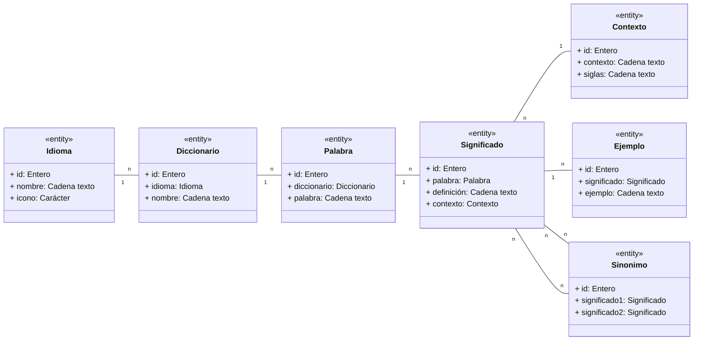
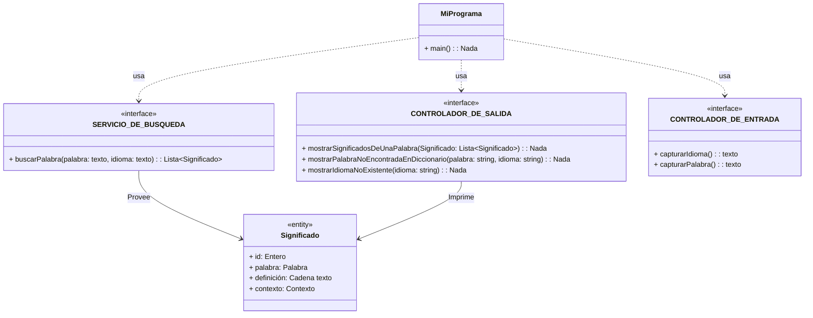
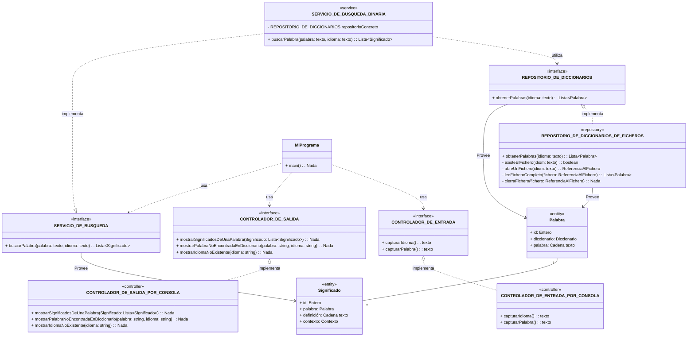

# Sistema de control de Versiones:

SCM - Source Code Management

- CVS           ARCHIOBSOLETO
- Subversion    MUY OBSOLETO (En Indra aún se sigue usando en pocos proyectos - legacy)
- GIT           ESTE ES EL BUENO (En Indra esto se usa en muchos proyectos.. y lo que estaba en svn se está migrando a git)

Estas herramientas nos permiten:
- Tener controladas multiples versiones de mi proyecto, incluso versiones paralelas entre si.
    v1.0.1
        v1.0.2
    v2.0.0
- Me sirven de copia de seguridad (servidor)
- Nos ayudan a a trabajar en equipo, donde varios desarrolladores pueden trabajar en el mismo proyecto:
  - CVS y SVN lo que me permiten es solicitar al servidor que guarda el proyecto el BLOQUEO de un fichero, de forma que nadie más pueda modificarlo.
  - GIT permite a varias personas trabajar sobre el mismo fichero... pero al hacerlo pueden pisarse uno al otro: GENERAR CONFLICTOS... que luego hay que arreglar.

## Diagrama entidad relación:

# Diagrama de Clases que ayude a identificar Componentes

## Enterprise Architect

- Herramienta de modelado UML de sistemas (software y hardware)

UML es un estándar ISO para crear diagramas de modelos de software:
- Diagramas estáticos o estructurales
    - Diagramas de clases
    - Diagramas de componentes
    - Diagramas de objetos
- Diagramas dinámicos o de comportamiento
  - Diagramas de secuencia
  - Diagramas de casos de uso
  - Diagramas de estados
  - Diagramas de actividades

Hay extensiones de UML:
- SysML: Para modelar sistemas de hardware
  Recogen muchos de los diagramas de UML (no todos) y añaden sus propios nuevos tipos de diagramas:
    - Diagramas de requerimientos
- BPMN: Para modelar procesos de negocio