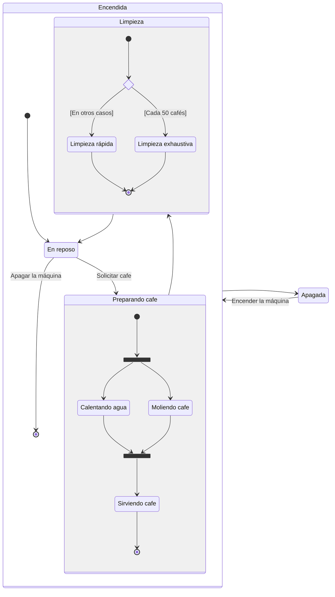
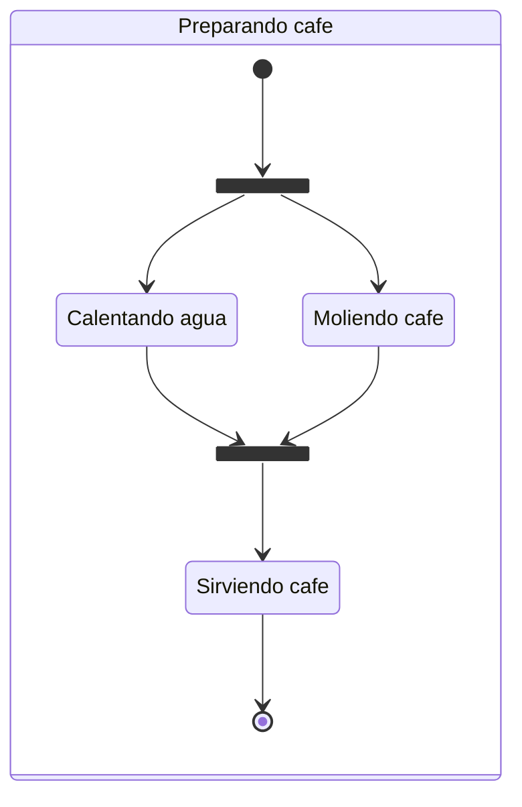
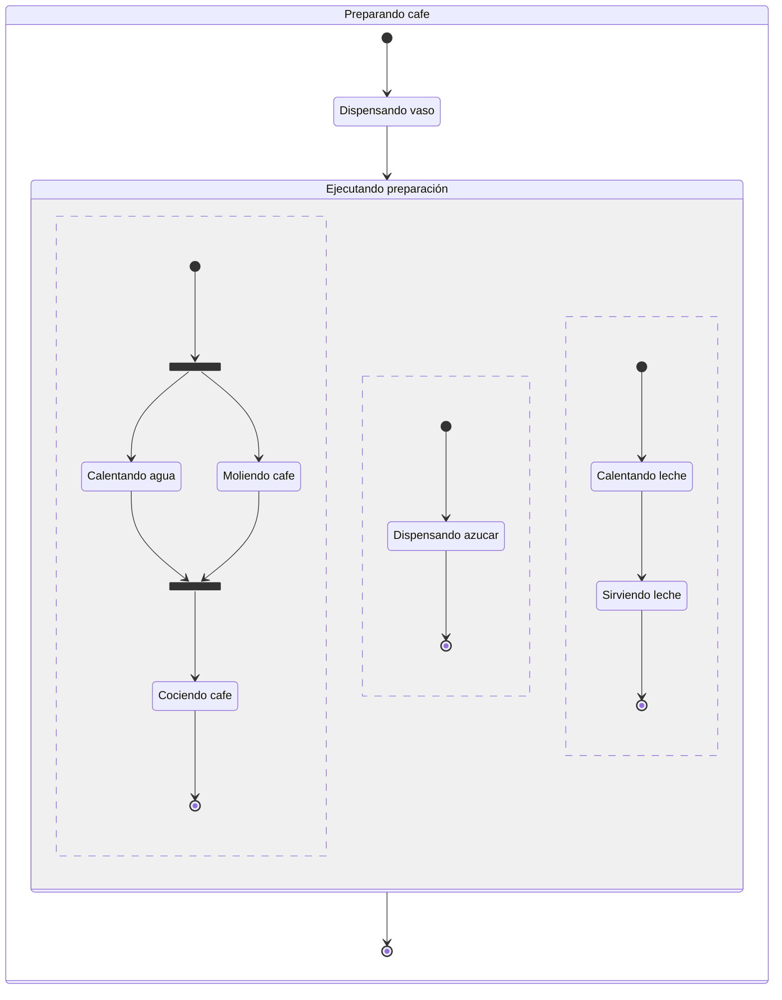
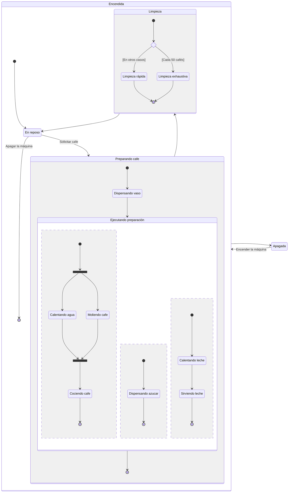
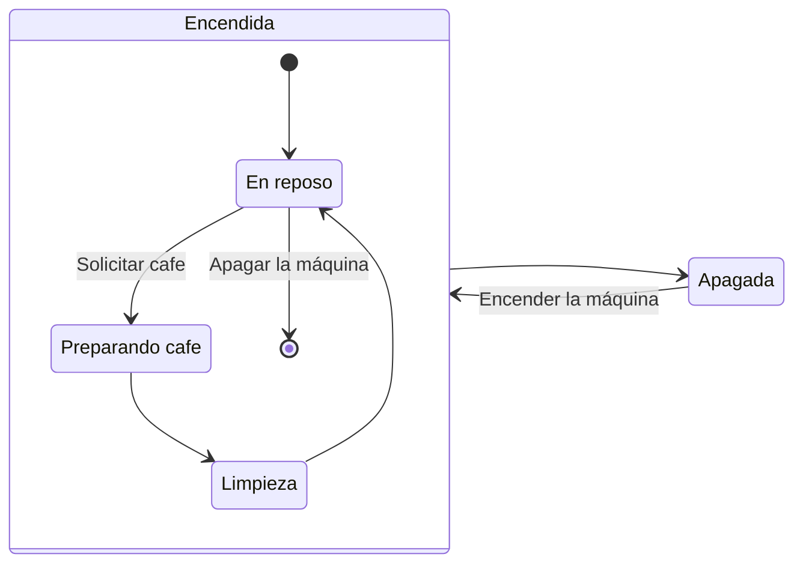

# Máquinas de estados

Diagramas muy potentes... y a la vez el concepto en si mismo de las máquinas de estados es muy potente.

Al modelar un sistema, muchas veces es útil pensar en términos de estados y transiciones entre estados. Eso es lo que reflejan los diagramas de máquinas de estados:

- Estados:                      Las situaciones en las que se puede encontrar el sistema, de forma que cuando está en una de ellas, 
                                se comporta de una forma determinada, distinta a cuando está en otro estado.
- Transiciones entre estados    Reflejan los cambios de estados posibles dentro de mi sistema
(y hasta aquí llegan los modelos tradicionales de máquinas de estados)
- Guardas                       Son condiciones que deben cumplirse para que se pueda realizar una transición de estados. Se representan entre corchetes en medio de las flechas.
- Eventos:                      Son las causas externas que provocan las transiciones de estados. Los escribimos en medio de las flechas.
- Acciones
- Regiones paralelas
- Tareas paralelas              Forks y Joins
- Estados jerárquicos           Estados que se componen de otros estados (subestados)
- Condicionales                 Choices

Un regla de oro es que una máquina de estados solo puede estar en un estado a la vez.

NOTA: Las tareas paralelas y las regiones paralelas de alguna forma rompen con la regla que dije antes, de que una máquina de estados solo puede estar en un estado a la vez. 

Conceptualmente lo que ocurre es otra cosa... es que entendemos esos estados paralelos como si fueran SUBMAQUINAS DE ESTADOS, que representamos dentro de un único diagrama de máquina de estados.

# MAQUINA EXPENDEDORA DE CAFE 

Estados? Apagada, Encendida, Cargando, Sirviendo, Averiada

Esto es un tema que UML resuelve, con el concepto de ESTADOS JERARQUICOS

LOS ESTADOS siempre SIEMPRE siempre se nombran con:
- Sustantivos
- Adjetivos
- Verbos en gerundio

Las TRANSICIONES siempre SIEMPRE siempre se nombran con:
- Verbos en infinitivo

De hecho, más adelante que veremos los diagramas de actividad, nos daremos cuenta que se parecen ESTETICAMENTE MUCHO los diagramas de máquinas de estados, pero en ellos, las cajas tendrán verbos en infinitivo, y las flechas tendrán sustantivos o adjetivos o verbos en gerundio.

DELANTE DE LOS NOMBRES DE ESTADO debo poder poner la palabra "está" y que tenga sentido.
DELANTE DE LOS NOMBRES DE LAS TRANSICIONES debo poder poner la palabra "Puedo" y que tenga sentido.

En general, en medio de las flechas solo pondremos acciones (verbos en infinitivo) que sean ejecutadas por un ser (humano) externo al sistema.

---

# Tareas paralelas (FORK y JOIN)

# REGIONES PARALELAS

La decisión entre representar trabajos paralelos mediante:
- Regiones paralelas
- Tareas paralelas
viene establecida por la división conceptual que haga de mi sistema en componentes/subsistemas.

Puedo modelar la cafetera entendiendo que:
- Tengo un subsistema que se encarga de la leche (calentarla, servirla)
- Tengo un subsistema que se encarga del café (calentar agua, moler café, servir café)
- Tengo un subsistema que se encarga del azúcar (servir azúcar)
Si modelo la cafetera con esto en la cabeza, utilizaré REGIONES PARALELAS.

Si por el contrario tengo un subsistema/sistema que él hace varias tareas simultáneamente, entonces utilizaré TAREAS PARALELAS.

En este caso lo estamos aplicando a UN APARATO FISICO (HARDWARE = CAFETERA), pero también se puede aplicar a un sistema software.

En el caso de un software:
- Usaríamos tareas paralelas si tenemos un componente (proceso) que puede abrir varios hilos de ejecución para hacer varias cosas a la vez paralelamente.
- Usaríamos regiones paralelas si tenemos varios componentes (procesos/ programas diferentes) que se ejecutan en paralelo, y que son independientes entre sí.

