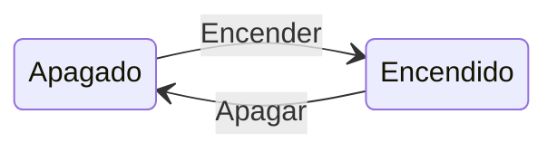
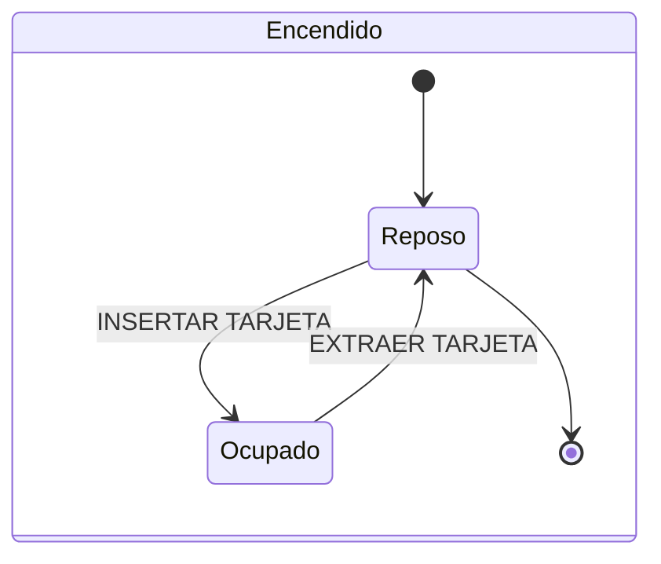
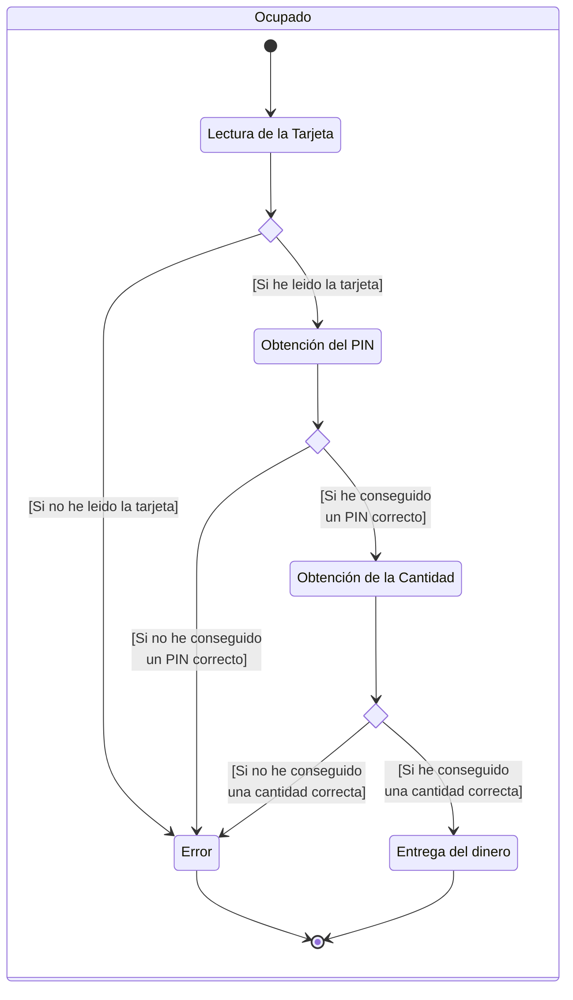
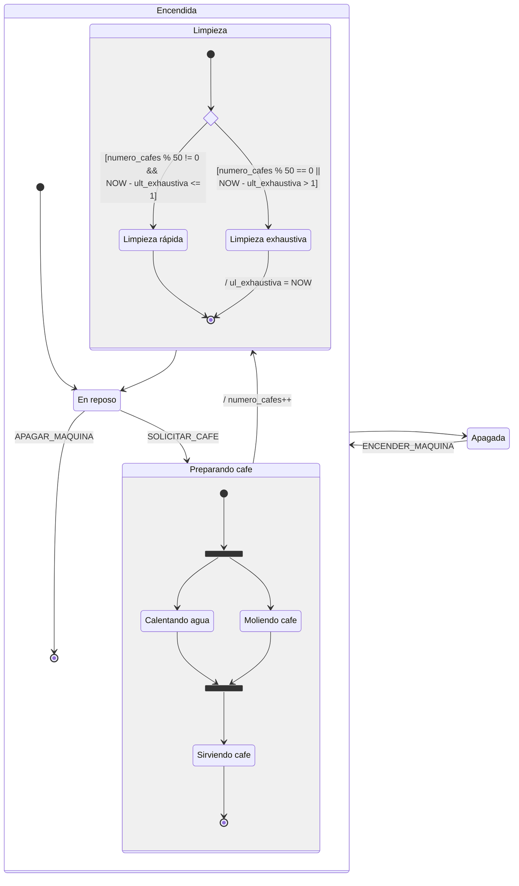

En UML, en los diagramas de estados, 
- Los EVENTOS se representan como textos en medio de una flecha.
  EL CONVENIO ES ESCRIBIRLOS EN MAYUSCULA  
- Las guardas, que son las condiciones que deben cumplirse para que se ejecute una transición se representan entre corchetes.

# Acciones y los contextos extendidos

Las máquinas de estados pueden necesitar de datos adicionales para funcionar. 
Por ejemplo, una guarda puede depender de un dato.
Esos datos los llamamos CONTEXTOS EXTENDIDOS de la máquina de estados.
En ocasiones algunas transiciones pueden alterar el contexto extendido de la máquina de estados, sus datos : ACCIONES
Eso se representa también en medio de la flecha de transición. Lo que hacemos es anteponer una BARRA / a la acción.

En esos textos que pongo en medio de las flechas, UML no se mete... más allá de estas cuestiones.
Hay 2 tendencias claras:
- Usar lenguaje humano
- Usar un pseudo-lenguaje de programación

Decidiré uno u otro en base al interlocutor al que vaya dirigido el diagrama.

