# Diagrama de secuencia del cajero

En este diagrama vamos a representar el happy path de un **cliente** que va a un cajero a *retirar dinero*.

```java
public class ClaseJava {
    public static void main(String[] args) {
        System.out.println("Hola mundo");
    }
}
```

## Happy path

```mermaid
sequenceDiagram

    actor           U as Cliente
    participant     C as Cajero
    participant     S as Servidor central

    U ->>+  C: 💳 Inserta tarjeta
    C -->>- U: Dame el PIN
    U ->>+  C: Introduce el PIN
    C ->>   C: Verifica PIN
    C -->>- U: Cuántos billetes?
    U ->>+  C: 200€
    C ->>   C: Verifica disponibilidad de dinero
    C ->>+  S: Verifica saldo y hacer la operación
    S -->>- C: OK
    C -->>  U: 💰 Aquí tienes tu dinero
    C -->>- U: Aquí tienes tu tarjeta
```



## Pin erroneo todas las veces


El nivel de detalle que estamos empleando en estos diagramas es bueno para empezar a detallar un trabajo... pero llega un momento que tengo que entrar en más nivel de detalle.

Por ejemplo, para mi equipo de desarrollo esos diagramas que tal van? Un poco de juguete...


## Diagrama de secuencia completo para sacar dinero

```mermaid
sequenceDiagram

    actor           U as Cliente
    participant     C as Cajero
    participant     S as Servidor central

    U ->>+  C:      💳 Inserta tarjeta

    rect rgb(255,255,230)
    note left of C:     LEER TARJETA
    critical            Verificar lectura de tarjeta
    option              Tarjeta no leida correctamente
        rect rgb(255,230,230)
            break           No se puede proceder
                C -->> U:   Le devuelvo la tarjeta
                C -->> U:   No se puede continuar, tarjeta ilegible
            end
        end
    end
    end

    rect rgb(230,255,230)
    note right of C:        CONSEGUIR PIN
    loop                    Hasta 3 veces mientras el pin no sea correcto
        C -->> U:           Dame el PIN
        critical            Espera de un PIN
            U ->> C:        Introduce el PIN
        option              El usuario solicita abortar
            U ->> C:        Aborta la operación
            rect rgb(255,230,230)
              break           No se puede proceder
                  C -->> U:   Operación abortada
                  C -->> U:   Toma tu tarjeta
              end
            end  
        option              El usuario no mete el PIN en 30 segundos
            rect rgb(255,230,230)
              break         No se puede proceder
                C -->> U:   No has metido el PIN en 30 segundos
                C -->> U:   Retengo la tarjeta
              end
            end
        end
        critical            Intentar usar el pin para acceder a la tarjeta
        C ->> C:            Acceder a los datos de la tarjeta
        option              PIN es incorrecto
            C -->> U:       El pin es incorrecto
        end
    end
    opt                     No he conseguido un PIN correcto
        rect rgb(255,230,230)
            break           No se puede proceder
                C -->> U:   No se ha conseguido un PIN correcto
                C -->> U:   Tarjeta retenida
            end
        end
    end
    end


    rect rgb(240,240,255)
        note left of S:     SACAR DINERO

        loop Hasta 3 intentos si la cantidad no es válida
            rect rgb(230,230,255)
                note left of C:         Cantidad
                C-->>U:                 Solicitar cantidad
                critical                     Esperar la cantidad la Cantidad
                    U->>C:                  Escribe la cantidad
                    opt                 Si no hay suficiente dinero o <BR/>no se le puede entregar
                        C-->>U:         No hay tanto dinero o <BR/>debe introducir una cantidad <BR/>múltiplo del tipo de<BR/> billetes disponibles
                    end
                option                 No se ha introducido la cantidad en 30 segundos
            rect rgb(255,230,230)
                        break                 
                            C->>U:                 No se puede procesar la operación
                            C->>U:                 💳 Entrega la tarjeta
                        end
                        end
                end
            end 
            rect rgb(230,230,255)

        critical                Confirmar con el servidor
        C->>S:                 Retirar importe solicitado
        S-->>C:                OK
        option                 No hay suficiente dinero en la cuenta
            S-->>C:            No hay suficiente dinero
            C-->>U:            No hay suficiente dinero
        option                Error del servidor
            rect rgb(255,230,230)
            S-->>C:            Error del servidor
            break                   Sistema no operativo
                C->>U:                 No se puede procesar la operación
                C->>U:                 💳 Entrega la tarjeta
            end
            end
        option              Timeout
            rect rgb(255,230,230)
            break                   Sistema no operativo
                C->>U:                 No se puede procesar la operación
                C->>U:                 💳 Entrega la tarjeta
            end
            end
        end
        end
        end
                    rect rgb(230,230,255)
        critical                Si no se ha conseguido una cantidad Correcta
            rect rgb(255,230,230)
                    break               
                        C-->>U:         💳 Entrega la tarjeta
                        C-->>U:         No se puede procesar la operación
                    end
                end
            end
            end

        C-->>U:                 💳 Entrega la tarjeta
        C-->>U:                 💰 Entrega el dinero
    end

```



No me pone cantidad en 30 segundos         OPTION DE UN CRITICAL
-    Si no contesta, retengo la tarjeta     BREAK

Hasta 3 veces:  LOOP
-    La cantidad que pone no la tengo disponible
-    No tengo combinación de billetes para la cantidad solicitada
-    No tiene dinero en la cuenta suficiente

Si después de 3 veces no consigo cantidad OPT (if de programación)
    BREAK: No se puede proceder


Todo va bien


