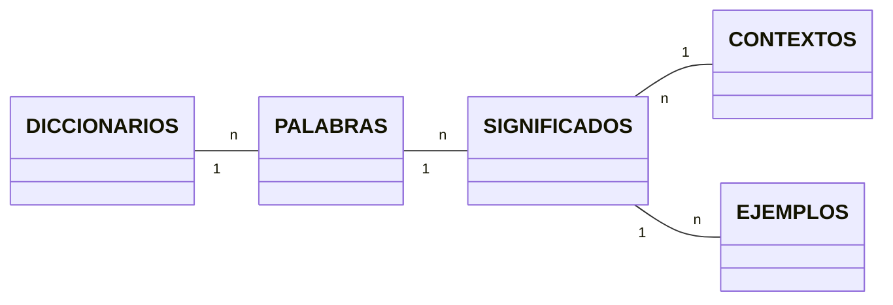

# Creemos una aplicación.

    $ buscarPalabra ES manzana
        La palabra manzana existe en el diccionario de Español y significa:
        - Fruto del manzano
  
    $ buscarPalabra ES melón
        La palabra manzana existe en el diccionario de Español y significa:
        - Fruto del melonero
              Ejemplo: Me encanta el melón!
              Ejemplo: Este melón está muy bueno!
        - fig. Persona con poca luces
              Ejemplo: Eres un melón!

    $ buscarPalabra ES archilococo
        La palabra archilococo NO existe en el diccionario de Español

# Opciones:

Vamos a tener ficheros de texto con las palabras de un idioma:
    - es.txt
    - en.txt
    - fr.txt
Cada linea es una palabra y sus significados

    manzana=Fruto del manzano
    melón=Fruto del melonero|[fig.]Persona con poca luces<Eres un melón>

## Si usase paradigma imperativo puro

Podría montar un programa con 300 líneas de código que hiciese lo que necesito. Pero sería un infierno de mantener y entender.

    VARIABLE idioma : TEXTO
    VARIABLE palabra : TEXTO
    idioma = PRIMER_ARGUMENTO_DEL_COMANDO
    palabra = SEGUNDO_ARGUMENTO_DEL_COMANDO

    IF NOT existe_fichero(idioma):
        print("El idioma " + idioma + " no está soportado")
        EXPLOTA CODIGO_ERROR = 127
    ELSE:
        fichero = abrir_fichero(idioma + ".txt")
        WHILE linea = leer_linea(fichero):
            partes = separar(linea, "=")
            IF partes[0] == palabra:
                significados = separar(partes[1], "|")
                FOR significado IN significados:
                    print(significado)

## Pero... el uso de un paradigma procedural, me ayudaría a hacer un programa más mantenible:

Funciones:
    - existe_el_fichero_del_idioma(idioma) -> BOOLEANO
    - leer_fichero_palabras(idioma) -> Mapa|Diccionarios|ArrayAsociativo
       Tabla clave / valor < significados (texto)
                ^
                palabras
    - imprimir_significados(palabra, significados)
    - imprimir_un_significado(significado)
    - leer_idioma_del_comando() -> TEXTO
    - leer_palabra_del_comando() -> TEXTO
    - imprimir_palabra_no_encontrada(palabra, idioma)

Cuando necesite TOCAR ALGO del programa (y lo necesitaré en futuro, FIJO!!)
si tengo funciones más pequeñas será más sencillo.
Si quiero cambiar la forma en la que se notifica al usuario que la palabra no existe en el idioma, qué función tengo que tocar??
    - imprimir_palabra_no_encontrada(palabra, idioma)

## La cosa es que usar un paradigma Orientado a Objetos mejoraría AUN MAS la estructura de mi código:

Lo que vamos a hacer es AGRUPAR esas funciones en un concepto que denominamos CLASE.
Juntaré funciones que sean de naturaleza SIMILAR, y las separaré de las que sean de otra naturaleza (que hagan otro tipo de cosas).
AQUI ENTRA EL CONCEPTO DE COHESION!

    FICHEROS DE PALABRAS
    - existe_el_fichero_del_idioma(idioma) -> BOOLEANO
    - leer_fichero_palabras(idioma) -> Mapa|Diccionarios|ArrayAsociativo

    IMPRIMIR POR PANTALLA (Modulo, Clase, Componente)
    - imprimir_palabra_no_encontrada(palabra, idioma)
    - imprimir_significados(palabra, significados)
    - imprimir_un_significado(significado)

    OBTENER DATOS DE UN COMANDO
    - leer_idioma_del_comando() -> TEXTO
    - leer_palabra_del_comando() -> TEXTO

Es como ir creando Bibliotecas de funciones, pero con un nombre más bonito: CLASES

Podríamos ir a más... Definir nuestros tipos de datos, con sus propiedades y sus operaciones.
Cuando modelamos sistemas usando POO, hay un tipo de clases muy sencillitas, que identificamos con facilidad: MODELOS/ENTIDAD
Los Modelos o Entidades representan Cosas TANGIBLES, que existen en el mundo real.

Modelo/Entidad: Diccionario
                     - Se caracteriza por tener :                               Qué puedo hacer (operaciones)
                       - Idioma                                                    - buscarPalabra("manzana") -> Lista de Significados
                       - Lista de Palabras
Modelo/Entidad: Palabra
                     - Se caracteriza por tener :
                       - caracteres (palabra en si misma)                           - dameTusSignificados() -> Lista de Significados
                       - Lista de Significados
Modelo/entidad: Significado
                     - Se caracteriza por tener :
                        - texto (el significado)                                    - estasEnDesuso() -> BOOLEANO
                        - contexto (si lo tiene, es opcional): figurativo, desuso, programación, México...
                        - Lista de Ejemplos (texto)

De hecho, si guardase esto en una BBDD Relacional (SQL), qué tablas tendríamos?

    DICCIONARIOS    <       PALABRAS         <    SIGNIFICADOS          <     EJEMPLOS
    - Id                     - Id                       - Id                    - Id
    - Idioma                 - IdDiccionario            - IdPalabra             - IdSignificado
                             - Palabra                  - Texto                 - Texto del Ejemplo
                                                        - IdContexto
                                                      V
                                                   CONTEXTOS
                                                    - Id
                                                    - Nombre

# DIAGRAMA ENTIDAD / RELACION

                                        EJEMPLOS
                                           n
                                           v
                                           1
    DICCIONARIOS   <   PALABRAS   <   SIGNIFICADOS  >  CONTEXTOS
                1     n         1   n           n      1

En las BBDD tenemos las relaciones 1-n y n-m (muchos a muchos)

Estos diagramas en UML se representan mediante lo que llamamos diagramas de clases.
Un tipo de diagrama de clases son los diagramas entidad / relación.

Con Mermaid, podemos generar fácilmente diagramas de clases en formato UML entidad / relación.

